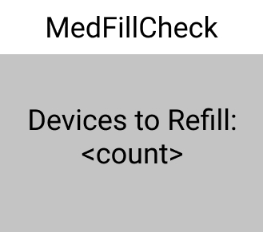

# MedFillCheck
REST Api made for an android app I am designing to make a virtual refill list based on automated dispensing system report.

### Project is no longer active

 

Project uses
- Flask
- Flask Marshmallow(for serialization)
- Flask JWT(for identity management and authentication)
- SQLAlchemy for database
- Blueprint for managing the individual resources
- passlib for hashing passwords

 
 
 

For the front-end(still to be implemented in Native Android), here are the designs:
 

 
 
Macro view of the devices in the hospital:
 

 
 
Device level view (includes medications)
 

 
 
Technician pulling medication to refill(via scanning or picking):
 

 
 
Pharmacist checking view(via scanning or picking):
 

 
 
Widget for checking devices that need refills:
 

